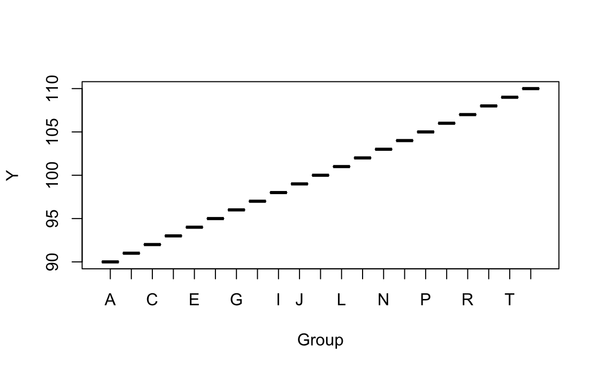
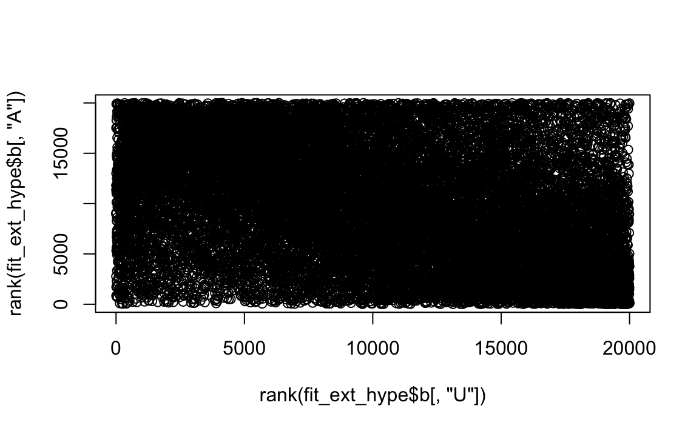
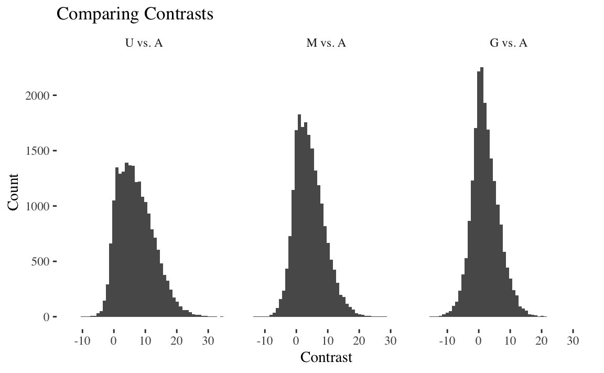
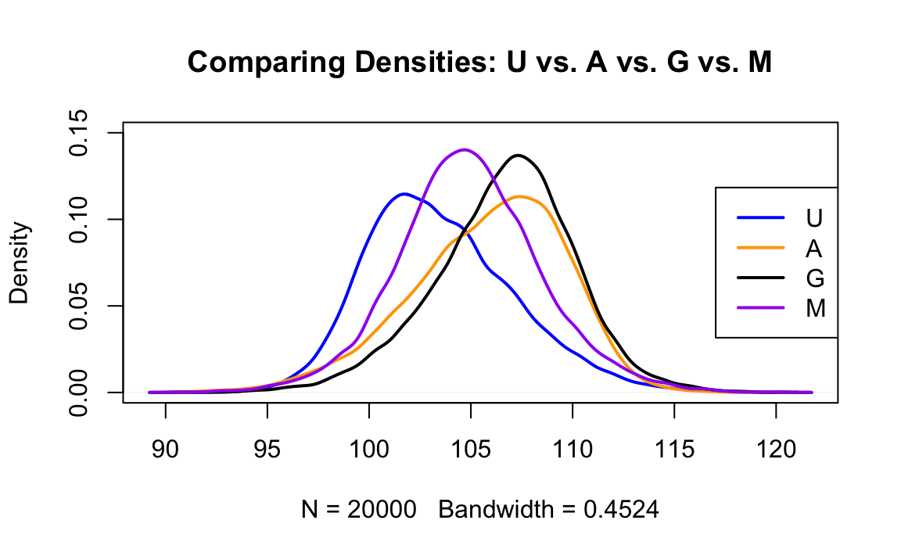
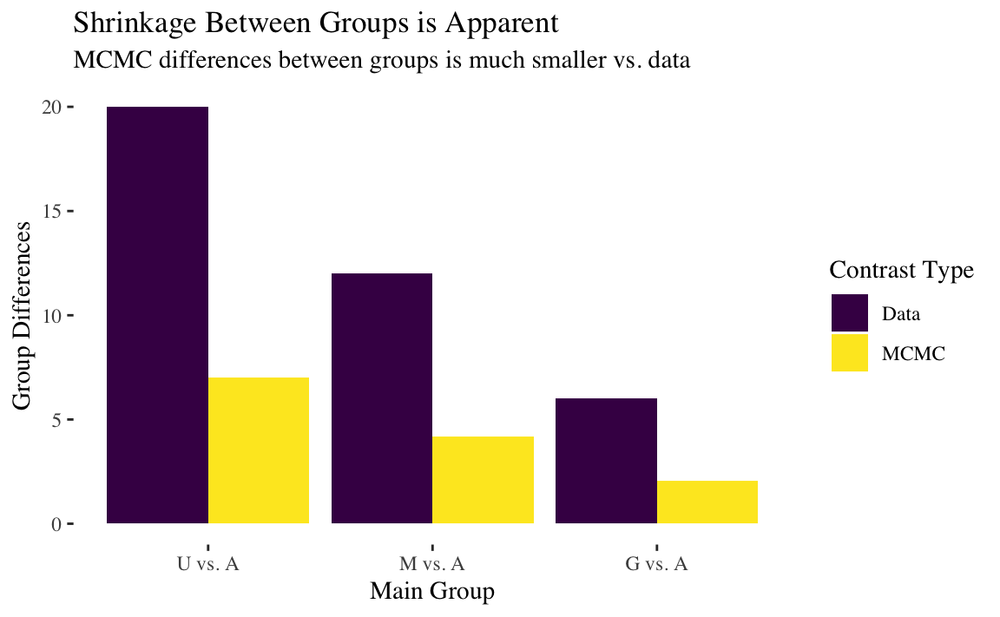
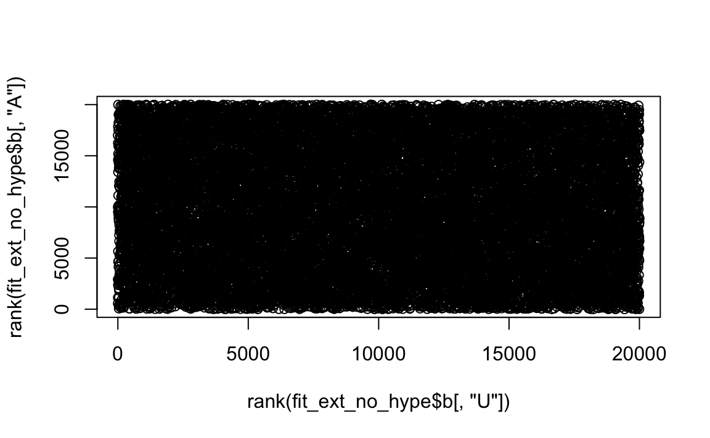

Week 3 Assignment
================
Joshua Goldberg
October, 16 2018

**This project helps understanding beta prior distribution for binomial
data**

# 1 Estimating the Risk of Tumor in a Group of Rats

## 1.1 Data

In example from Section 5.1 of \[G\] the goal was estimation of the
probability \(\theta\) of tumor in a population of female laboratory
rats of type “F344” that receive a zero dose of the drug (control
group). In the experiment 4 out of 14 rats developed a tumor.

``` r
Data <- c(s = 14, k = 4)
```

## 1.2 Model

Select binomial model \(yi∼Binom(\theta)\) with probability of tumor
\(\theta\) and beta prior distribution for the parameter
\(\theta∼Beta(\alpha,\beta)\).

Suppose we know from historical observation of population of “F344” the
mean and the variance of beta distribution for \(\theta\).

Using formulas in the interactive demonstration of beta distribution
convert mean value \(\mu=0.136\) and standard deviation
\(\sigma=0.1034\) of observed empirical probabilities into shapes of
beta distribution \(\alpha,\beta\).

``` r
mu <- .136
sigma_squared <- .1034^2
a <- ((1 - mu) / sigma_squared - 1 / mu) * (mu^2)
b <- a * (1 / mu - 1)

cbind(a, b)
```

    ##             a        b
    ## [1,] 1.358688 8.631663

``` r
x <- seq(from = 0, to = 1, by = .001)
priorBetaDens <- dbeta(x, shape1 = a, shape2 = b)
x[which.max(priorBetaDens)]
```

    ## [1] 0.045

``` r
plot(x, priorBetaDens, type = "l", lwd = 3)
abline(v = .05)
```

<!-- -->

## 1.3 Posterior distribution by formulas

Calculate parameters of posterior distribution.

``` r
postA <- Data["k"][[1]] + a
postB <- Data["s"][[1]] - Data["k"][[1]] + b
posteriorBetaDens <- dbeta(x, shape1 = postA, shape2 = postB)
c(postA = postA, postB = postB)
```

    ##     postA     postB 
    ##  5.358688 18.631663

## 1.4 Comparison

Compare prior and posterior distributions and explain the difference.

The posterior distribution has new mode that can be calculated by
formula \(\omega=\sigma−1\alpha+\beta−2\) for \(\alpha,\beta>1\), or
directly from the plot of the
density:

``` r
cbind(prior = x[which.max(priorBetaDens)], posterior = x[which.max(posteriorBetaDens)])
```

    ##      prior posterior
    ## [1,] 0.045     0.198

The posterior has shifted dramatically to the right, implying a weak
prior.

``` r
plot(
  x,
  priorBetaDens,
  type = 'l',
  lwd = 3,
  col = 'blue',
  ylim = c(0, 25),
  xlim = c(0, .2)
)
lines(x, posteriorBetaDens, lwd = 3, col = 'orange')
legend(
  "topright",
  legend = c("prior", "posterior"),
  col = c("blue", "orange"),
  lwd = 3
)
```

<!-- -->

Mean, variance, and
concentration:

``` r
(muPosterior = postA / (postA + postB))
```

    ## [1] 0.2233685

``` r
(varPosterior <- postA * postB / (postA + postB) ^ 2 / (postA + postB + 1))
```

    ## [1] 0.006941679

``` r
(kappaPosterior <- postA + postB)
```

    ## [1] 23.99035

## 1.5 Grid approximation

Assume that probability of tumor \(\theta\) in control group is
concentrated around unknown mode \(\omega\) of beta distribution with
concentration level of 20 (\(x\theta\)).

In addition \[\omega∼Beta(A_\omega,B_\omega)\]

Belief based on historical observations is that parameter \(\omega\) has
a tendency to be around 0.4 with concentration 12.

``` r
omega <- .4
K <- 12
(A_omega <- omega * (K - 2) + 1)
```

    ## [1] 5

``` r
(B_omega <- (1 - omega) * (K - 2) + 1)
```

    ## [1] 7

``` r
K_theta <- 20

Omega <- Theta <- seq(0 , 1 , length = 101)
plot(Omega, dbeta(Omega, A_omega, B_omega))
```

<!-- -->

The joint prior is:
\(p(\theta,\omega)=p(\theta|\omega)p(\omega)=dbeta(\theta|\omega(100−2)+1,(1−\omega)(100−2)+1)dbeta(\omega|A_\omega,B_\omega)\)

``` r
jointPrior <- function(theta, omega, A_omega, B_omega, K) {
  dbeta(omega, A_omega, B_omega) * dbeta(theta, omega * (K - 2) + 1, (1 - omega) * (K - 2) + 1)
}

dens <- expand.grid(Omega, Theta)
colnames(dens) <- c("Omega", "Theta")
dens$Prior <- apply(dens, 1, function(z) jointPrior(z[1], z[2], A_omega, B_omega, K))
Prior.theta.omega <- matrix(dens$Prior, 101, 101)
Prior.theta.omega <- Prior.theta.omega / sum(Prior.theta.omega) #Joint prior
Prior.omega.marginal <- apply(Prior.theta.omega, 2, sum)
Prior.omega.marginal <- Prior.omega.marginal / sum(Prior.omega.marginal) * 100 #Omega marginal prior
matplot(Omega,
        cbind(Prior.omega.marginal, dbeta(Omega, A_omega, B_omega)),
        type = "l",
        ylab = "Marginal p(omega)")
```

<!-- -->

``` r
Prior.theta.marginal <- apply(Prior.theta.omega, 1, sum)
Prior.theta.marginal <- Prior.theta.marginal / sum(Prior.theta.marginal) * 100 #Theta marginal prior
plot(Theta, Prior.theta.marginal, type = "l", ylab = "Marginal p(theta)")
```

<!-- -->

``` r
persp(
  Theta,
  Omega,
  Prior.theta.omega,
  d = 1,
  theta = -25,
  phi = 20,
  main = "Joint Prior Distribution"
)
```

<!-- -->

``` r
contour(
  x = Omega,
  y = Theta,
  z = Prior.theta.omega,
  ylab = "omega",
  xlab = "theta",
  main = "Joint Prior Distribution"
)
```

<!-- -->

Dependence is strong between \(\theta\) and prior:

``` r
par(mfrow = c(3, 1))
Prior.theta.omega.25 <- jointPrior(Theta, 0.25, A_omega, B_omega, K)
Prior.theta.omega.25 <- Prior.theta.omega.25 / sum(Prior.theta.omega.25) * 100
plot(
  Theta,
  Prior.theta.omega.25,
  type = "l",
  ylab = "p(theta|omega=0.25)",
  main = "Marginal prior for Theta"
)

Prior.theta.omega.5 <- jointPrior(Theta, 0.5, A_omega, B_omega, K)
Prior.theta.omega.5 <- Prior.theta.omega.5 / sum(Prior.theta.omega.5) * 100
plot(Theta,
     jointPrior(Theta, 0.5, A_omega, B_omega, K),
     type = "l",
     ylab = "p(theta|omega=0.5)")

Prior.theta.omega.75 <- jointPrior(Theta, 0.75, A_omega, B_omega, K)
Prior.theta.omega.75 <- Prior.theta.omega.75 / sum(Prior.theta.omega.75) * 100
plot(Theta,
     jointPrior(Theta, 0.75, A_omega, B_omega, K),
     type = "l",
     ylab = "p(theta|omega=0.75)")
```

<!-- -->

The likelihood is based on: \(p(y|\theta)=\theta^9(1−\theta)^3\).

``` r
likeli <- function(theta, s, k) {
  theta ^ k * (1 - theta) ^ (s - k)
}

likelihood <- likeli(Theta, 20, 8)
plot(Theta,
     likelihood,
     type = "l",
     ylab = "p(y|theta)",
     main = "Likelihood")
```

<!-- -->

``` r
Posterior <- apply(Prior.theta.omega, 2, function(z) z * likelihood)
Posterior <- Posterior / sum(Posterior)
```

Plot the joint posterior distribution.

``` r
persp(
  Theta,
  Omega,
  Posterior,
  d = 1,
  theta = -25,
  phi = 20,
  main = "Joint Posterior Distribution"
)
```

<!-- -->
