Week 7 Assignment
================
Joshua Goldberg
November, 13 2018

# References

\[K\] John K. Kruschke, Doing Bayesian Data Analysis, A Tutorial with R,
JAGS, and STAN, 2015, Elsevier.

Source the utilities file from \[K\].

``` r
source("./DBDA2Eprograms/DBDA2E-utilities.R")
```

    ## 
    ## *********************************************************************
    ## Kruschke, J. K. (2015). Doing Bayesian Data Analysis, Second Edition:
    ## A Tutorial with R, JAGS, and Stan. Academic Press / Elsevier.
    ## *********************************************************************

This project helps understanding comparison of groups in Gaussian model
without
predictors.

# Use at least 2 different methods proving that the groups in section 3.3 of part 1 of the workshop are different.

## Data

``` r
myDataFrame = read.csv("documents-MScA Bayesian Methods (32014)-MScA 32014 Lecture 8-TwoGroupIQ.csv")
y = as.numeric(myDataFrame[, "Score"])
x = as.numeric(as.factor(myDataFrame[, "Group"]))
(xLevels = levels(as.factor(myDataFrame[, "Group"])))
```

    ## [1] "Placebo"    "Smart Drug"

``` r
Ntotal = length(y)
dataList = list(
  y = y,
  x = x,
  Ntotal = Ntotal,
  meanY = mean(y),
  sdY = sd(y)
)
dataList
```

    ## $y
    ##   [1] 102 107  92 101 110  68 119 106  99 103  90  93  79  89 137 119 126
    ##  [18] 110  71 114 100  95  91  99  97 106 106 129 115 124 137  73  69  95
    ##  [35] 102 116 111 134 102 110 139 112 122  84 129 112 127 106 113 109 208
    ##  [52] 114 107  50 169 133  50  97 139  72 100 144 112 109  98 106 101 100
    ##  [69] 111 117 104 106  89  84  88  94  78 108 102  95  99  90 116  97 107
    ##  [86] 102  91  94  95  86 108 115 108  88 102 102 120 112 100 105 105  88
    ## [103]  82 111  96  92 109  91  92 123  61  59 105 184  82 138  99  93  93
    ## [120]  72
    ## 
    ## $x
    ##   [1] 2 2 2 2 2 2 2 2 2 2 2 2 2 2 2 2 2 2 2 2 2 2 2 2 2 2 2 2 2 2 2 2 2 2 2
    ##  [36] 2 2 2 2 2 2 2 2 2 2 2 2 2 2 2 2 2 2 2 2 2 2 2 2 2 2 2 2 1 1 1 1 1 1 1
    ##  [71] 1 1 1 1 1 1 1 1 1 1 1 1 1 1 1 1 1 1 1 1 1 1 1 1 1 1 1 1 1 1 1 1 1 1 1
    ## [106] 1 1 1 1 1 1 1 1 1 1 1 1 1 1 1
    ## 
    ## $Ntotal
    ## [1] 120
    ## 
    ## $meanY
    ## [1] 104.1333
    ## 
    ## $sdY
    ## [1] 22.43532

## Robust model

Robust assumption of Student-t distribution.

``` stan
data {
    int<lower=1> Ntotal;
    int x[Ntotal];          //Group variable
    real y[Ntotal];
    real meanY;
    real sdY;
}
transformed data {
    real unifLo;
    real unifHi;
    real normalSigma;
    real expLambda;         //Parameter of prior for nu 
    unifLo = sdY/100;
    unifHi = sdY*100;
    normalSigma = sdY*100;
    expLambda = 1/30.0;      //Setting value for expLambda
}
parameters {
    real<lower=0> nu;
    real mu[2];                 //Making 2 groups
    real<lower=0> sigma[2];     //Making 2 groups
}
model {
    sigma ~ uniform(unifLo, unifHi);        //Recall that sigma is a vector of 2 numbers
    mu ~ normal(meanY, normalSigma);        //Recall that mu is a vector of 2 numbers
    nu~exponential(expLambda);      //Exponential prior for nu
    for (i in 1:Ntotal){
        y[i] ~ student_t(nu, mu[x[i]], sigma[x[i]]);           //Student_t distribution for y with nested group index
    }
    
}
```

### Fit `stanmodel` with `sampling()`

``` r
parameters = c("mu" , "sigma" , "nu")     # The parameters to be monitored
adaptSteps = 500               # Number of steps to "tune" the samplers
burnInSteps = 1000
nChains = 4
thinSteps = 1
numSavedSteps <- 5000

# Get MC sample of posterior:
stanFitRobust <- sampling(
  object = stanDsoRobust,
  data = dataList,
  pars = parameters,
  # optional
  chains = nChains,
  cores = nChains,
  iter = (ceiling(numSavedSteps / nChains) * thinSteps
          + burnInSteps),
  warmup = burnInSteps,
  init = "random",
  # optional
  thin = thinSteps
)
```

### Fit results

``` r
stanFitRobust
```

    ## Inference for Stan model: 9a9c40e6afa16673620cbf98f3528972.
    ## 4 chains, each with iter=2250; warmup=1000; thin=1; 
    ## post-warmup draws per chain=1250, total post-warmup draws=5000.
    ## 
    ##             mean se_mean   sd    2.5%     25%     50%     75%   97.5%
    ## mu[1]      99.24    0.03 1.82   95.58   98.04   99.24  100.47  102.77
    ## mu[2]     107.12    0.04 2.73  101.88  105.28  107.11  108.90  112.52
    ## sigma[1]   11.39    0.03 1.79    8.36   10.15   11.23   12.48   15.31
    ## sigma[2]   18.07    0.04 2.70   13.23   16.22   17.87   19.80   23.68
    ## nu          3.93    0.03 1.80    1.94    2.84    3.53    4.49    8.16
    ## lp__     -451.08    0.04 1.68 -455.33 -451.90 -450.73 -449.87 -448.91
    ##          n_eff Rhat
    ## mu[1]     4782    1
    ## mu[2]     5817    1
    ## sigma[1]  4429    1
    ## sigma[2]  3997    1
    ## nu        3181    1
    ## lp__      1969    1
    ## 
    ## Samples were drawn using NUTS(diag_e) at Tue Nov 13 09:31:10 2018.
    ## For each parameter, n_eff is a crude measure of effective sample size,
    ## and Rhat is the potential scale reduction factor on split chains (at 
    ## convergence, Rhat=1).

``` r
plot(stanFitRobust)
```

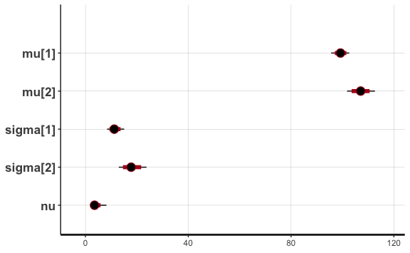<!-- -->

``` r
rstan::traceplot(stanFitRobust, ncol = 1, inc_warmup = F)
```

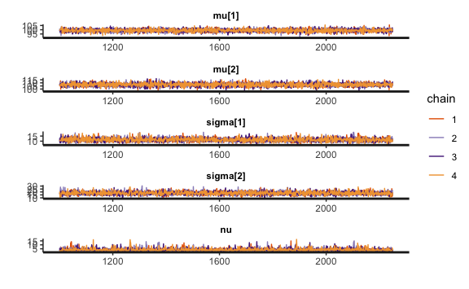<!-- -->

``` r
pairs(stanFitRobust, pars = c("nu","mu","sigma"))
```

<!-- -->

``` r
stan_diag(stanFitRobust,information = "sample",chain = 0)
```

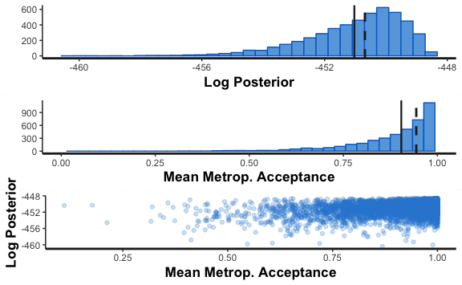<!-- -->

Same fit results from the workshop, of
course.

## Extract \(\mu\) and \(\sigma\) from chains to measure difference between the two groups

``` r
dis1 <- data.frame(
  Mu = rstan::extract(stanFitRobust, pars = "mu[1]")$'mu[1]',
  Sigma = rstan::extract(stanFitRobust, pars = "sigma[1]")$'sigma[1]'
)

dis2 <- data.frame(
  Mu = rstan::extract(stanFitRobust, pars = "mu[2]")$'mu[2]',
  Sigma = rstan::extract(stanFitRobust, pars = "sigma[2]")$'sigma[2]'
)

dis_df <- bind_rows("group_1" = dis1, "group_2" = dis2, .id = "Group") %>% 
  mutate(Group = factor(Group)) %>% as_tibble()

denDis1 <- density(dis1[, "Mu"])
denDis2 <- density(dis2[, "Mu"])
plot(denDis1, col = "blue", xlim = c(90, 120))
lines(denDis2, col = "green")
```

<!-- -->

## Two different methods to distinguish groups

## Correlation matrix

There is a positive correlation between `Mu` and `Sigma`, suggesting
higher values for `group_2`.

``` r
ggcor(dis_df, Group)
```

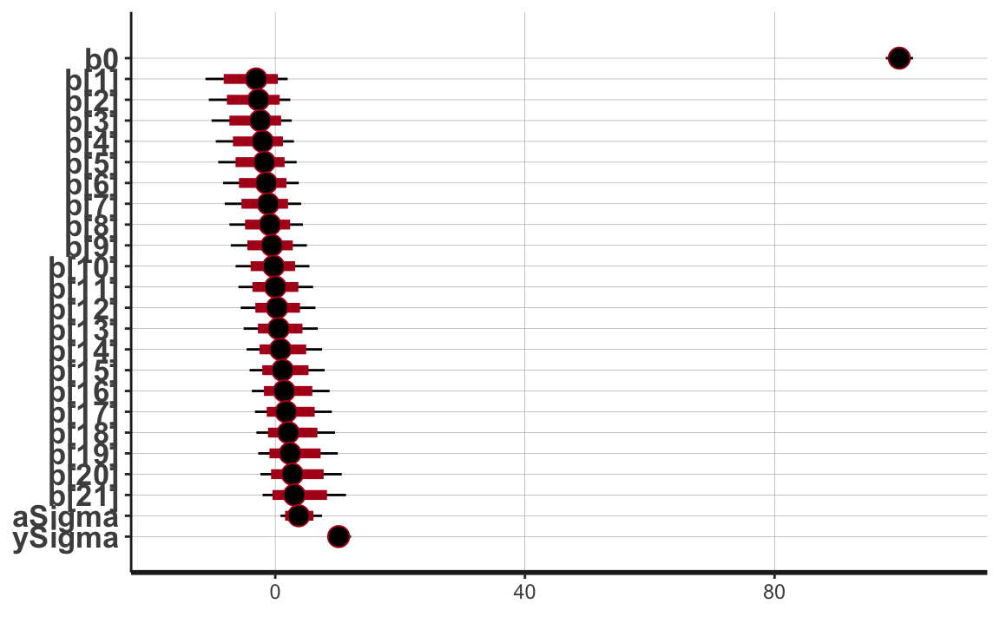<!-- -->

## Logistic

We will use logistic regression to see if predictability of groups can
be achieved with `Mu` and `Sigma`.

``` r
rec <- recipe(Group ~ Mu + Sigma, data = dis_df)
  
control <- trainControl(
  method = "cv",
  number = 10,
  summaryFunction = twoClassSummary,
  classProbs = TRUE,
  savePredictions = TRUE
)

fit_logit <- train(
  rec,
  data = dis_df,
  metric = "ROC",
  method = "glm",
  trControl = control,
  family = binomial(link = "logit")
) 
```

Summary of model shows that both `Mu` and `Sigma` are statistically
significant for predicting `Group`.

``` r
summary(fit_logit)
```

    ## 
    ## Call:
    ## NULL
    ## 
    ## Deviance Residuals: 
    ##     Min       1Q   Median       3Q      Max  
    ## -3.4658  -0.0094   0.0000   0.0042   3.2926  
    ## 
    ## Coefficients:
    ##               Estimate Std. Error z value Pr(>|z|)    
    ## (Intercept) -186.51251    9.44281  -19.75   <2e-16 ***
    ## Mu             1.62496    0.08476   19.17   <2e-16 ***
    ## Sigma          1.35461    0.07532   17.98   <2e-16 ***
    ## ---
    ## Signif. codes:  0 '***' 0.001 '**' 0.01 '*' 0.05 '.' 0.1 ' ' 1
    ## 
    ## (Dispersion parameter for binomial family taken to be 1)
    ## 
    ##     Null deviance: 13862.94  on 9999  degrees of freedom
    ## Residual deviance:   506.99  on 9997  degrees of freedom
    ## AIC: 512.99
    ## 
    ## Number of Fisher Scoring iterations: 10

### Visualize predictions with group labels

``` r
logit_predictions <- predict.train(fit_logit) %>%
            data.frame(Group = .)

dis_df_logit <- dis_df %>% mutate(logit_prediction = factor(logit_predictions$Group, levels = c("group_1", "group_2")))

dis_df_logit %>% 
  ggplot(aes(Mu, Sigma, color = logit_prediction)) +
  geom_point() +
  facet_grid(
    cols = vars(Group), labeller = labeller(Group = c(
      group_1 = "Actual Group 1",
      group_2 = "Actual Group 2"))
  ) +
  scale_color_viridis_d(name = "Logit Predictions", labels = c("Group 1", "Group 2")) +
  labs(title = "Logit Solution Classification Shows Demarcation",
       subtitle = "A few mistakes near the edge")
```

<!-- -->

``` r
compare_predictions_groups <- bind_rows(
  "prediction" = dis_df_logit %>%
    group_by(logit_prediction) %>% 
    summarise_if(is.numeric, mean) %>% 
    rename(Group = logit_prediction) %>% 
    ungroup(),
  "data" = dis_df %>% 
    group_by(Group) %>% 
    summarise_if(is.numeric, mean), .id = "label"
  ) %>% 
  arrange(Mu)
```

<table class="table table-striped" style="margin-left: auto; margin-right: auto;">

<caption>

Prediction means are close to actual group means

</caption>

<thead>

<tr>

<th style="text-align:left;">

label

</th>

<th style="text-align:left;">

Group

</th>

<th style="text-align:right;">

Mu

</th>

<th style="text-align:right;">

Sigma

</th>

</tr>

</thead>

<tbody>

<tr>

<td style="text-align:left;">

prediction

</td>

<td style="text-align:left;">

group\_1

</td>

<td style="text-align:right;">

99.21816

</td>

<td style="text-align:right;">

11.38175

</td>

</tr>

<tr>

<td style="text-align:left;">

data

</td>

<td style="text-align:left;">

group\_1

</td>

<td style="text-align:right;">

99.23575

</td>

<td style="text-align:right;">

11.39443

</td>

</tr>

<tr>

<td style="text-align:left;">

data

</td>

<td style="text-align:left;">

group\_2

</td>

<td style="text-align:right;">

107.12123

</td>

<td style="text-align:right;">

18.07191

</td>

</tr>

<tr>

<td style="text-align:left;">

prediction

</td>

<td style="text-align:left;">

group\_2

</td>

<td style="text-align:right;">

107.12616

</td>

<td style="text-align:right;">

18.07388

</td>

</tr>

</tbody>

</table>

``` r
compare_proportions <- bind_rows("logit" =  logit_predictions %>% 
                                   janitor::tabyl(Group),
                                 "data" = dis_df %>% 
                                   janitor::tabyl(Group), .id = "label") %>% 
  arrange(Group)
```

<table class="table table-striped" style="margin-left: auto; margin-right: auto;">

<caption>

Logit vs. Data: Proportions are Similar

</caption>

<thead>

<tr>

<th style="text-align:left;">

label

</th>

<th style="text-align:left;">

Group

</th>

<th style="text-align:right;">

n

</th>

<th style="text-align:right;">

percent

</th>

</tr>

</thead>

<tbody>

<tr>

<td style="text-align:left;">

logit

</td>

<td style="text-align:left;">

group\_1

</td>

<td style="text-align:right;">

4992

</td>

<td style="text-align:right;">

0.4992

</td>

</tr>

<tr>

<td style="text-align:left;">

data

</td>

<td style="text-align:left;">

group\_1

</td>

<td style="text-align:right;">

5000

</td>

<td style="text-align:right;">

0.5000

</td>

</tr>

<tr>

<td style="text-align:left;">

logit

</td>

<td style="text-align:left;">

group\_2

</td>

<td style="text-align:right;">

5008

</td>

<td style="text-align:right;">

0.5008

</td>

</tr>

<tr>

<td style="text-align:left;">

data

</td>

<td style="text-align:left;">

group\_2

</td>

<td style="text-align:right;">

5000

</td>

<td style="text-align:right;">

0.5000

</td>

</tr>

</tbody>

</table>

## Clustering

Next, k-means clustering will be used to see if we reach the same
conclusion as logistic regression.

### Preprocess data for k-means with train/test split and scaling data.

``` r
set.seed(1)
test_train_km <- initial_split(dis_df, prop = 79/125)

dis_df_train_km <- training(test_train_km)
dis_df_test_km <- testing(test_train_km)

dis_train_scaled_recipe <- dis_df_train_km %>%
  recipe() %>%
  step_rm(Group) %>% 
  steps::step_scale_min_max(all_numeric())

dis_train_scaled_prep <- prep(dis_train_scaled_recipe, training = dis_df_train_km, retain = TRUE)
```

    ## [1] "Mu"    "Sigma"

``` r
dis_train_scaled <- juice(dis_train_scaled_prep)
dis_test_scaled <- bake(dis_train_scaled_prep, newdata = dis_df_test_km)
```

    ## [1] "Mu"    "Sigma"

### Generate the k-means

``` r
# 1. Run kmeans for 2-10 total clusters.
kclusters <- data.frame(k = 2:5) %>% 
  group_by(k) %>% 
  do(kclust = kmeans(dis_train_scaled, .$k, iter.max = 100, nstart = 100))

# 2. Save the VAF (Variance Inflation Factor) for each number of clusters
clusterings <- kclusters %>%
  group_by(k) %>%
  do(glance(.$kclust[[1]])) %>% 
  mutate(VAF = betweenss / totss)

# 3/4 Size of the clusters & Centroids of the clusters
clusters <- kclusters %>%
  group_by(k) %>%
  do(tidy(.$kclust[[1]])) %>%
  mutate(size_prop = size / nrow(dis_train_scaled)) %>% 
  select(k, size, size_prop, cluster, everything())

assignments <- kclusters %>%
  group_by(k) %>%
  do(augment(.$kclust[[1]], dis_train_scaled))
```

### The Scree plot

There is a slight elbow at 3 k’s.

``` r
clusterings %>% 
  ggplot(aes(k, VAF)) + 
  geom_line() +
  geom_point() +
  scale_x_continuous(breaks = seq(min(clusterings$k), max(clusterings$k), 1)) +
  scale_y_continuous(labels = scales::percent) +
  labs(title = "Variance Accounted for Across k's", 
       y = "VAF")
```

<!-- -->

However, interestingly, there is an even split for `k = 2`. This may
suggest two distinct groups.

``` r
clusters %>% 
  ggplot(aes(factor(k), size_prop)) +
  geom_col(aes(fill = size_prop), color = "white") +
  scale_fill_viridis_c(name = "Cluster Size\nProportion", labels = scales::percent) +
  scale_y_continuous(labels = scales::percent) +
  labs(title = "Comparing Cluster Size Across k",
       x = "Number of Clusters", y = "Cluster Size Proportion of Training Count") +
  theme(legend.title = element_text(size = 10))
```

<!-- -->

Fit k-means with 2
clusters:

``` r
kmclusters_k2 <- kmeans(dis_train_scaled, centers = 2, iter.max = 100, nstart = 1000)
assignment_k2 <- augment(kmclusters_k2, dis_train_scaled) %>% 
  mutate(Group = dis_df_train_km$Group,
         Mu = dis_df_train_km$Mu,
         Sigma = dis_df_train_km$Sigma,
         cluster = factor(.cluster, levels = c(1, 2))) %>% 
  select(-.cluster)
```

### Visualize clusters with group labels

K-means does a good job of separating the known groups:

``` r
assignment_k2 %>% 
  ggplot(aes(Mu, Sigma, color = cluster)) +
  geom_point() +
  facet_grid(
    cols = vars(Group), labeller = labeller(Group = c(
      group_1 = "Group 1",
      group_2 = "Group 2"))
  ) +
  scale_color_viridis_d(name = "Cluster") +
  labs(title = "K-means Cluster Solution Shows Difference in Groups",
       subtitle = "Demarcation is clear, with some mistakes near the edge")
```

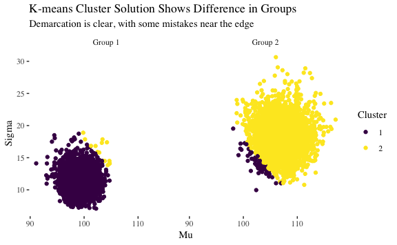<!-- -->

``` r
compare_clusters_groups <- bind_rows(
  centers_k2 <- assignment_k2 %>%
    group_by(cluster) %>% 
    summarise_if(is.numeric, mean) %>% 
    rename(`cluster/group` = cluster),
  dis_df %>% 
    group_by(Group) %>% 
    summarise_if(is.numeric, mean) %>% 
    rename(`cluster/group` = Group)
) %>% 
  arrange(Mu)
```

<table class="table table-striped" style="margin-left: auto; margin-right: auto;">

<caption>

Cluster means are close to actual group means

</caption>

<thead>

<tr>

<th style="text-align:left;">

cluster/group

</th>

<th style="text-align:right;">

Mu

</th>

<th style="text-align:right;">

Sigma

</th>

</tr>

</thead>

<tbody>

<tr>

<td style="text-align:left;">

group\_1

</td>

<td style="text-align:right;">

99.23575

</td>

<td style="text-align:right;">

11.39443

</td>

</tr>

<tr>

<td style="text-align:left;">

1

</td>

<td style="text-align:right;">

99.30267

</td>

<td style="text-align:right;">

11.43455

</td>

</tr>

<tr>

<td style="text-align:left;">

group\_2

</td>

<td style="text-align:right;">

107.12123

</td>

<td style="text-align:right;">

18.07191

</td>

</tr>

<tr>

<td style="text-align:left;">

2

</td>

<td style="text-align:right;">

107.16278

</td>

<td style="text-align:right;">

18.11756

</td>

</tr>

</tbody>

</table>

### Holdout

Holdout results are stable relative to train, so the solution is
credible. Groups appear to be
different.

``` r
km_holdout_k2 <- kmeans(dis_test_scaled, centers = kmclusters_k2$centers)
assignment_k2_holdout <- augment(km_holdout_k2, dis_test_scaled) %>% 
  mutate(Group = dis_df_test_km$Group,
         Mu = dis_df_test_km$Mu,
         Sigma = dis_df_test_km$Sigma,
         cluster = factor(.cluster, levels = c(1, 2))) %>% 
  select(-.cluster)
```

``` r
assignment_k2_holdout %>% 
  ggplot(aes(Mu, Sigma, color = cluster)) +
  geom_point() +
  facet_grid(
    cols = vars(Group), labeller = labeller(Group = c(
      group_1 = "Group 1",
      group_2 = "Group 2"))
  ) +
  scale_color_viridis_d(name = "Cluster") +
  labs(title = "Stable Holdout")
```

<!-- -->

``` r
compare_clusters_holdout_groups <- bind_rows(
  centers_k2 <- assignment_k2_holdout %>%
    group_by(cluster) %>% 
    summarise_if(is.numeric, mean) %>% 
    rename(`cluster/group` = cluster),
  dis_df %>% 
    group_by(Group) %>% 
    summarise_if(is.numeric, mean) %>% 
    rename(`cluster/group` = Group)
) %>% 
  arrange(Mu)
```

<table class="table table-striped" style="margin-left: auto; margin-right: auto;">

<caption>

Holdout means are stable and reach the same
conclusion

</caption>

<thead>

<tr>

<th style="text-align:left;">

cluster/group

</th>

<th style="text-align:right;">

Mu

</th>

<th style="text-align:right;">

Sigma

</th>

</tr>

</thead>

<tbody>

<tr>

<td style="text-align:left;">

1

</td>

<td style="text-align:right;">

99.23168

</td>

<td style="text-align:right;">

11.39076

</td>

</tr>

<tr>

<td style="text-align:left;">

group\_1

</td>

<td style="text-align:right;">

99.23575

</td>

<td style="text-align:right;">

11.39443

</td>

</tr>

<tr>

<td style="text-align:left;">

group\_2

</td>

<td style="text-align:right;">

107.12123

</td>

<td style="text-align:right;">

18.07191

</td>

</tr>

<tr>

<td style="text-align:left;">

2

</td>

<td style="text-align:right;">

107.20181

</td>

<td style="text-align:right;">

18.15137

</td>

</tr>

</tbody>

</table>

# Analyze convergence of MCMC in section 5.1.4 of part 2 of the workshop. Try to adjust parameters and rerun the process to obtain the a better quality of MCMC.

## Data

Read the data and create the data list.

``` r
df <- read.csv("DBDA2Eprograms/HierLinRegressData.csv")

dataList <- list(
  Ntotal = length(df$Y),
  y = df$Y,
  x = df$X,
  Ngroups = max(df$Subj),
  group = df$Subj
)
```

## Original Stan model

``` stan
data {
    int<lower=1> Ntotal;
    vector[Ntotal] y;
    vector[Ntotal] x;
    int<lower=1> Ngroups;
    int<lower=1, upper=Ngroups> group[Ntotal];
}
transformed data {
    real meanY;
    real sdY;
    vector[Ntotal] zy; // normalized y
    real meanX;
    real sdX;
    vector[Ntotal] zx; // normalized x
    meanY = mean(y);
    sdY = sd(y);
    zy = (y - meanY) / sdY;
    meanX = mean(x);
    sdX = sd(x);
    zx = (x - meanX) / sdX;
}
parameters {
    real<lower=0> zsigma;
    real<lower=0> nu;
    real zbeta0mu;
    real zbeta1mu;
    real<lower=0> zbeta0sigma;
    real<lower=0> zbeta1sigma;
    vector[Ngroups] zbeta0;
    vector[Ngroups] zbeta1;
}
transformed parameters {
    real<lower=0> sigma;
    real beta0mu;
    real beta1mu;
    vector[Ngroups] beta0;
    vector[Ngroups] beta1;
    // Transform to original scale:
    sigma = zsigma * sdY;
    beta0mu = meanY + zbeta0mu * sdY  - zbeta1mu * meanX * sdY / sdX;
    beta1mu = zbeta1mu * sdY / sdX;
    beta0 = meanY + zbeta0 * sdY  - zbeta1 * meanX * sdY / sdX; // vectorized
    beta1 = zbeta1 * sdY / sdX;                                 // vectorized
}
model {
    zsigma ~ uniform(0.001, 1000);
    nu ~ exponential(1/30.0);
    zbeta0mu ~ normal(0, 10.0^2);
    zbeta1mu ~ normal(0, 10.0^2);
    zbeta0sigma ~ uniform(0.001, 1000);
    zbeta1sigma ~ uniform(0.001, 1000);
    zbeta0 ~ normal(zbeta0mu, zbeta0sigma);  // vectorized
    zbeta1 ~ normal(zbeta1mu, zbeta1sigma);  // vectorized
    for (i in 1:Ntotal) {
        zy[i] ~ student_t(1+nu, zbeta0[group[i]] + zbeta1[group[i]] * x[i], zsigma);
    }
}
```

## Fit original Stan model

``` r
fit_robust <- sampling (
  stanDsoRobustRegPanel,
  data = dataList,
  pars = c(
    "nu",
    "sigma",
    "beta0mu",
    "beta1mu",
    "beta0",
    "beta1",
    "zbeta0sigma",
    "zbeta1sigma"
  ),
  iter = 5000,
  chains = 4,
  cores = 4
)
```

There were 1843 divergent transitions after warmup. The workshop tries
to decrease `stepsize` and increase `iter`, `adapt_delta`, and
`max_treedepth`.

``` r
fit_robust_adjust <- sampling (
  stanDsoRobustRegPanel,
  data = dataList,
  pars = c(
    "nu",
    "sigma",
    "beta0mu",
    "beta1mu",
    "beta0",
    "beta1",
    "zbeta0sigma",
    "zbeta1sigma"
  ),
  iter = 50000,
  chains = 4,
  cores = 4,
  control = list(
    adapt_delta = 0.999,
    stepsize = 0.01,
    max_treedepth = 15
  )
)
```

However, many divergences still occurr:

``` r
plot(fit_robust_adjust)
```

<!-- -->

``` r
rstan::traceplot(fit_robust_adjust)
```

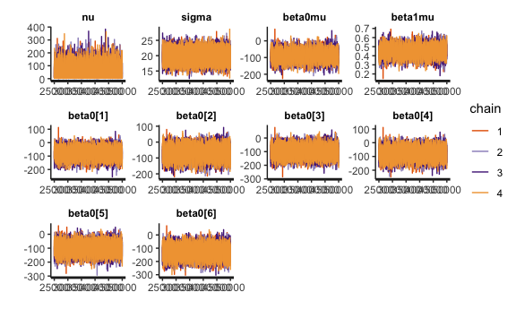<!-- -->

``` r
pairs(fit_robust_adjust, pars = c("nu", "sigma", "beta0mu", "beta1mu"))
```

<!-- -->

Adjusting prior for `zsigma` `zbeta0sigma`, and `zbeta0sigma` to
`cauchy`:

``` stan
data {
    int<lower=1> Ntotal;
    vector[Ntotal] y;
    vector[Ntotal] x;
    int<lower=1> Ngroups;
    int<lower=1, upper=Ngroups> group[Ntotal];
}
transformed data {
    real meanY;
    real sdY;
    vector[Ntotal] zy; // normalized y
    real meanX;
    real sdX;
    vector[Ntotal] zx; // normalized x
    meanY = mean(y);
    sdY = sd(y);
    zy = (y - meanY) / sdY;
    meanX = mean(x);
    sdX = sd(x);
    zx = (x - meanX) / sdX;
}
parameters {
    real<lower=0> zsigma;
    real<lower=0> nu;
    real zbeta0mu;
    real zbeta1mu;
    real<lower=0> zbeta0sigma;
    real<lower=0> zbeta1sigma;
    vector[Ngroups] zbeta0;
    vector[Ngroups] zbeta1;
}
transformed parameters {
    real<lower=0> sigma;
    real beta0mu;
    real beta1mu;
    vector[Ngroups] beta0;
    vector[Ngroups] beta1;
    // Transform to original scale:
    sigma = zsigma * sdY;
    beta0mu = meanY + zbeta0mu * sdY  - zbeta1mu * meanX * sdY / sdX;
    beta1mu = zbeta1mu * sdY / sdX;
    beta0 = meanY + zbeta0 * sdY  - zbeta1 * meanX * sdY / sdX; // vectorized
    beta1 = zbeta1 * sdY / sdX;                                 // vectorized
}
model {
    zsigma ~ cauchy(0, 2);
    nu ~ exponential(1/30.0);
    zbeta0mu ~ normal(0, 10.0^2);
    zbeta1mu ~ normal(0, 10.0^2);
    zbeta0sigma ~ cauchy(0, 2);
    zbeta1sigma ~ cauchy(0, 2);
    zbeta0 ~ normal(zbeta0mu, zbeta0sigma);  // vectorized
    zbeta1 ~ normal(zbeta1mu, zbeta1sigma);  // vectorized
    for (i in 1:Ntotal) {
        zy[i] ~ student_t(1+nu, zbeta0[group[i]] + zbeta1[group[i]] * x[i], zsigma);
    }
}
```

Additionally, decreasing `stepsize` and increasing `warmup`, `iter`,
`adapt_delta`, and `max_treedepth`:

``` r
fit_robust_cauchy <- sampling(
  stanDsoRobustRegPanel_cauchy,
  data = dataList,
  pars = c(
    "nu",
    "sigma",
    "beta0mu",
    "beta1mu",
    "beta0",
    "beta1",
    "zbeta0sigma",
    "zbeta1sigma"
  ),
  iter = 5000,
  chains = 4,
  cores = 4,
  warmup = 1500,
  thin = 5,
  control = list(
    adapt_delta = 0.999999999,
    stepsize = 0.0001,
    max_treedepth = 20
  )
)
```

``` r
pairs(fit_robust_cauchy, pars = c("nu", "sigma", "beta0mu", "beta1mu"))
```

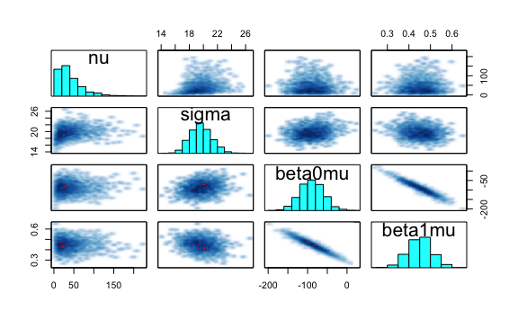<!-- -->

There is an auto-correlation problem with the \(\beta0\mu\) and
\(\beta1\mu\)

``` r
stan_ac(fit_robust_cauchy, pars = c("nu", "sigma", "beta0mu", "beta1mu"))
```

<!-- -->

By adjusting priors to `cauchy` and increasing several parameters, we
were able to dramatically reduce the divergences from ~1800 to 3.
However, the drawback to this approach (compared to parameterizing the
model better based on understanding of the data) is speed. The model
takes much longer to fit with a small step size. And while increasing
the warmup ameliorates the auto-correlation, it does not fix it
completely.

# Using `life_exp` as response fit Gaussian and robust non-hierarchical regression models using Bayesian approach

## Data

`state.x77` from datasets used in multiple regression example in
Statistical Analysis (MScA 31007):

``` r
dta <- as.data.frame(state.x77) %>% 
  janitor::clean_names()
```

<table>

<caption>

`stat.x77`

</caption>

<thead>

<tr>

<th style="text-align:left;">

</th>

<th style="text-align:right;">

population

</th>

<th style="text-align:right;">

income

</th>

<th style="text-align:right;">

illiteracy

</th>

<th style="text-align:right;">

life\_exp

</th>

<th style="text-align:right;">

murder

</th>

<th style="text-align:right;">

hs\_grad

</th>

<th style="text-align:right;">

frost

</th>

<th style="text-align:right;">

area

</th>

</tr>

</thead>

<tbody>

<tr>

<td style="text-align:left;">

Alabama

</td>

<td style="text-align:right;">

3615

</td>

<td style="text-align:right;">

3624

</td>

<td style="text-align:right;">

2.1

</td>

<td style="text-align:right;">

69.05

</td>

<td style="text-align:right;">

15.1

</td>

<td style="text-align:right;">

41.3

</td>

<td style="text-align:right;">

20

</td>

<td style="text-align:right;">

50708

</td>

</tr>

<tr>

<td style="text-align:left;">

Alaska

</td>

<td style="text-align:right;">

365

</td>

<td style="text-align:right;">

6315

</td>

<td style="text-align:right;">

1.5

</td>

<td style="text-align:right;">

69.31

</td>

<td style="text-align:right;">

11.3

</td>

<td style="text-align:right;">

66.7

</td>

<td style="text-align:right;">

152

</td>

<td style="text-align:right;">

566432

</td>

</tr>

<tr>

<td style="text-align:left;">

Arizona

</td>

<td style="text-align:right;">

2212

</td>

<td style="text-align:right;">

4530

</td>

<td style="text-align:right;">

1.8

</td>

<td style="text-align:right;">

70.55

</td>

<td style="text-align:right;">

7.8

</td>

<td style="text-align:right;">

58.1

</td>

<td style="text-align:right;">

15

</td>

<td style="text-align:right;">

113417

</td>

</tr>

<tr>

<td style="text-align:left;">

Arkansas

</td>

<td style="text-align:right;">

2110

</td>

<td style="text-align:right;">

3378

</td>

<td style="text-align:right;">

1.9

</td>

<td style="text-align:right;">

70.66

</td>

<td style="text-align:right;">

10.1

</td>

<td style="text-align:right;">

39.9

</td>

<td style="text-align:right;">

65

</td>

<td style="text-align:right;">

51945

</td>

</tr>

<tr>

<td style="text-align:left;">

California

</td>

<td style="text-align:right;">

21198

</td>

<td style="text-align:right;">

5114

</td>

<td style="text-align:right;">

1.1

</td>

<td style="text-align:right;">

71.71

</td>

<td style="text-align:right;">

10.3

</td>

<td style="text-align:right;">

62.6

</td>

<td style="text-align:right;">

20

</td>

<td style="text-align:right;">

156361

</td>

</tr>

<tr>

<td style="text-align:left;">

Colorado

</td>

<td style="text-align:right;">

2541

</td>

<td style="text-align:right;">

4884

</td>

<td style="text-align:right;">

0.7

</td>

<td style="text-align:right;">

72.06

</td>

<td style="text-align:right;">

6.8

</td>

<td style="text-align:right;">

63.9

</td>

<td style="text-align:right;">

166

</td>

<td style="text-align:right;">

103766

</td>

</tr>

</tbody>

</table>

``` r
data_list <- list(
  Ntotal = nrow(dta),
  life_exp = dta$life_exp
)
```

## Models

Fitting intercept only models. First normal, then robust.

### Normal

``` stan
data {
    int<lower=0> Ntotal;
    vector<lower=0>[Ntotal] life_exp;
}
transformed data {
    real mean_life_exp;
    real sd_life_exp;
    real unifLo;
    real unifHi;
    mean_life_exp = mean(life_exp);
    sd_life_exp = sd(life_exp);
    unifLo = sd_life_exp / 1000;
    unifHi = sd_life_exp * 1000;
}
parameters {
    real beta0;
    real <lower=0> sigma;
}
model {
  sigma ~ uniform(unifLo, unifHi);
  life_exp ~ normal(beta0, sigma);
}
```

``` r
fit_normal_life_exp <- sampling(
  stan_normal_model,
  data = data_list,
  pars = c(
    "beta0",
    "sigma"
  ),
  iter = 5000,
  chains = 4,
  cores = 4,
)
```

Model estimates mean of `life_exp`:

``` r
show(fit_normal_life_exp)
```

    ## Inference for Stan model: e71bd361acb5cac7e89369ac91f60be6.
    ## 4 chains, each with iter=5000; warmup=2500; thin=1; 
    ## post-warmup draws per chain=2500, total post-warmup draws=10000.
    ## 
    ##         mean se_mean   sd   2.5%    25%    50%    75%  97.5% n_eff Rhat
    ## beta0  70.88    0.00 0.19  70.50  70.75  70.88  71.01  71.26  9112    1
    ## sigma   1.38    0.00 0.15   1.13   1.27   1.36   1.47   1.70  7474    1
    ## lp__  -39.95    0.02 1.02 -42.68 -40.36 -39.64 -39.22 -38.96  4574    1
    ## 
    ## Samples were drawn using NUTS(diag_e) at Tue Nov 13 09:32:55 2018.
    ## For each parameter, n_eff is a crude measure of effective sample size,
    ## and Rhat is the potential scale reduction factor on split chains (at 
    ## convergence, Rhat=1).

Data mean: 70.8786

All model diagnostics looks good:

``` r
pairs(fit_normal_life_exp, pars = c("beta0", "sigma"))
```

<!-- -->

``` r
stan_trace(fit_normal_life_exp, pars = c("beta0", "sigma"))
```

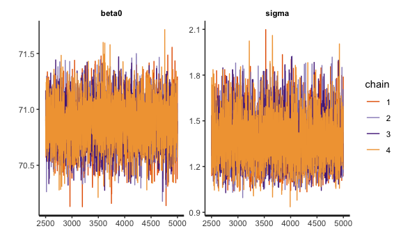<!-- -->

``` r
stan_ac(fit_normal_life_exp, pars = c("beta0", "sigma"))
```

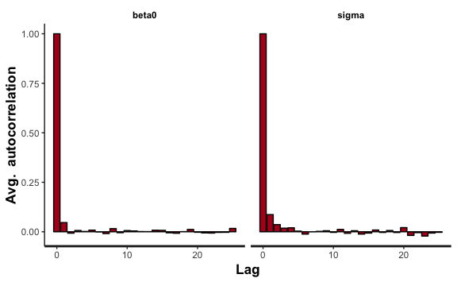<!-- -->

``` r
stan_dens(fit_normal_life_exp, pars = c("beta0", "sigma"))
```

<!-- -->

``` r
stan_diag(fit_normal_life_exp)
```

<!-- -->

### Robust

``` stan
data {
    int<lower=1> Ntotal;
    vector<lower=0>[Ntotal] life_exp;
}
transformed data {
    real expLambda;
    real mean_life_exp;
    real sd_life_exp;
    real unifLo;
    real unifHi;
    expLambda = 1 / 30.0;
    mean_life_exp = mean(life_exp);
    sd_life_exp = sd(life_exp);
    unifLo = sd_life_exp / 1000;
    unifHi = sd_life_exp * 1000;
}
parameters {
    real<lower=0> nu; 
    real beta0;
    real<lower=0> sigma;
}
model {
  nu ~ exponential(expLambda);
  sigma ~ uniform(unifLo, unifHi);
  life_exp ~ student_t(nu, beta0, sigma);
}
```

``` r
fit_robust_life_exp <- sampling(
  stan_robust_model,
  data = data_list,
  pars = c(
    "beta0",
    "sigma",
    "nu"
  ),
  iter = 5000,
  chains = 4,
  cores = 4,
)
```

\(\nu\) is high, so probably Gaussian.

``` r
show(fit_robust_life_exp)
```

    ## Inference for Stan model: 4c1c3ec54062deb9ea15dce8e4d95bc3.
    ## 4 chains, each with iter=5000; warmup=2500; thin=1; 
    ## post-warmup draws per chain=2500, total post-warmup draws=10000.
    ## 
    ##         mean se_mean    sd   2.5%    25%    50%    75%  97.5% n_eff Rhat
    ## beta0  70.88    0.00  0.20  70.50  70.75  70.88  71.01  71.27  7151    1
    ## sigma   1.34    0.00  0.15   1.07   1.23   1.33   1.43   1.66  7362    1
    ## nu     40.82    0.34 31.46   5.98  18.28  32.19  54.40 124.21  8513    1
    ## lp__  -55.59    0.02  1.22 -58.80 -56.12 -55.28 -54.71 -54.21  4867    1
    ## 
    ## Samples were drawn using NUTS(diag_e) at Tue Nov 13 09:33:41 2018.
    ## For each parameter, n_eff is a crude measure of effective sample size,
    ## and Rhat is the potential scale reduction factor on split chains (at 
    ## convergence, Rhat=1).

``` r
plot(fit_robust_life_exp)
```

<!-- -->

Slight memory in \(\sigma\) and \(\beta\):

``` r
pairs(fit_robust_life_exp, pars = c("beta0", "sigma", "nu"))
```

<!-- -->

``` r
stan_trace(fit_robust_life_exp, pars = c("beta0", "sigma", "nu"))
```

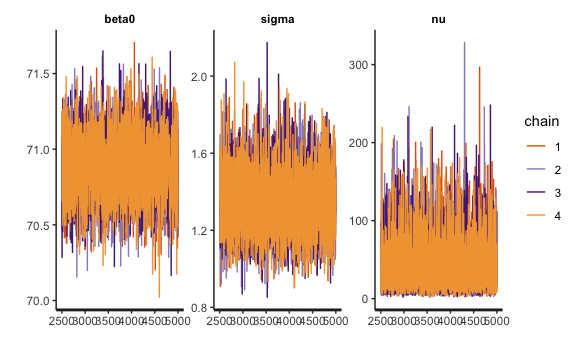<!-- -->

``` r
stan_ac(fit_robust_life_exp, pars = c("beta0", "sigma", "nu"))
```

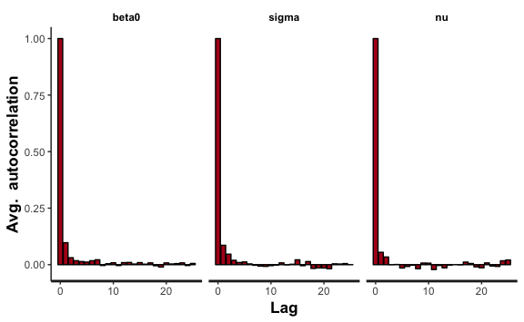<!-- -->

``` r
stan_dens(fit_robust_life_exp, pars = c("beta0", "sigma", "nu"))
```

<!-- -->

``` r
stan_diag(fit_robust_life_exp)
```

<!-- -->

### Trying with predictor `hs_grad`

``` r
model_df <- dta %>% select(hs_grad)
data_list <- list(
  Ntotal = nrow(dta),
  Nx = ncol(model_df),
  x = as.matrix(model_df),
  life_exp = dta$life_exp
)
```

``` stan
data {
    int<lower=1> Ntotal;
    int<lower=1> Nx;
    vector[Ntotal] life_exp;
    matrix[Ntotal, Nx] x;
}
transformed data {
    real expLambda;
    real mean_life_exp;
    real sd_life_exp;
    real unifLo;
    real unifHi;
    mean_life_exp = mean(life_exp);
    sd_life_exp = sd(life_exp);
    unifLo = sd_life_exp / 1000;
    unifHi = sd_life_exp * 1000;
}
parameters {
    real beta0;
    vector[Nx] xbeta;
    real<lower=0> sigma;
}
model {
  sigma ~ uniform(unifLo, unifHi);
  life_exp ~ normal(beta0 + x * xbeta, sigma);
}
```

``` r
fit_normal_life_exp_predictors <- sampling(
  stan_normal_predictors,
  data = data_list,
  pars = c(
    "beta0",
    "xbeta",
    "sigma"
  ),
  iter = 5000,
  chains = 4,
  cores = 4,
)
```

Initial takeaways from first model:

  - `beta0` is now 65.75 (down from the mean of 70.88), so average
    `life_exp` is 65.75 when there are no high school grads

  - However, `hs_grad` is significant and increases `life_expectancy`
    for every one unit change in `hs_grad`

<!-- end list -->

``` r
show(fit_normal_life_exp_predictors)
```

    ## Inference for Stan model: 1f82668a852b76fbe0953b6e6582a139.
    ## 4 chains, each with iter=5000; warmup=2500; thin=1; 
    ## post-warmup draws per chain=2500, total post-warmup draws=10000.
    ## 
    ##            mean se_mean   sd   2.5%    25%    50%    75%  97.5% n_eff Rhat
    ## beta0     65.73    0.02 1.08  63.59  65.01  65.72  66.45  67.84  3199    1
    ## xbeta[1]   0.10    0.00 0.02   0.06   0.08   0.10   0.11   0.14  3193    1
    ## sigma      1.13    0.00 0.12   0.92   1.05   1.12   1.20   1.39  3747    1
    ## lp__     -30.34    0.02 1.26 -33.57 -30.92 -30.01 -29.42 -28.90  3226    1
    ## 
    ## Samples were drawn using NUTS(diag_e) at Tue Nov 13 09:34:32 2018.
    ## For each parameter, n_eff is a crude measure of effective sample size,
    ## and Rhat is the potential scale reduction factor on split chains (at 
    ## convergence, Rhat=1).

``` r
plot(fit_normal_life_exp_predictors, pars = "xbeta")
```

<!-- -->

  - There is memory in \(\sigma\) and betas

  - `beta0` and `beta1` show a strong negative
relationship

<!-- end list -->

``` r
pairs(fit_normal_life_exp_predictors, pars = c("beta0", "xbeta", "sigma"))
```

<!-- -->

``` r
stan_trace(fit_normal_life_exp_predictors, pars = c("beta0", "xbeta", "sigma"))
```

<!-- -->

``` r
stan_ac(fit_normal_life_exp_predictors, pars = c("beta0", "xbeta", "sigma"))
```

<!-- -->

``` r
stan_dens(fit_normal_life_exp_predictors, pars = c("beta0", "xbeta", "sigma"))
```

<!-- -->

``` r
stan_diag(fit_normal_life_exp_predictors)
```

<!-- -->

## Takeaways

  - Question 1 data was proven distinct between classes based on
    logistic and k-means; there were clear distinctions between groups
    with both methods

  - Question 2 was unsolvable; however, we were able to significantly
    reduce divergences at the cost of painfully slower computation

  - No issues with any model diagnostics for all models in question 3

  - Intercept models simply estimated the mean from the data (no
    surprise)

  - Robust model was unnecessary due to high \(\nu\), so Gaussian will
    likely be fine

  - `hs_grad` showed to be significant with a positive loading when
    viewing HDI
