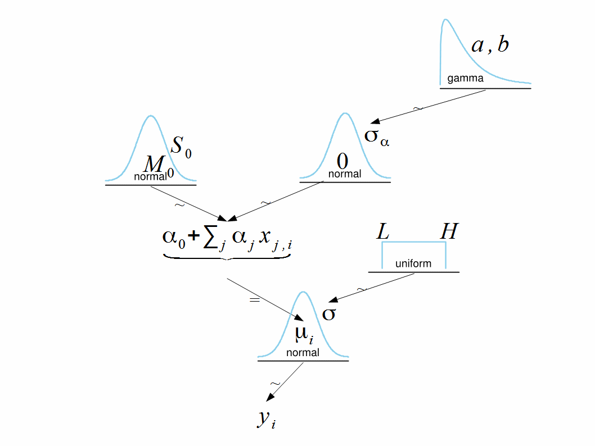

```{r Global-options, include=FALSE}
knitr::opts_chunk$set(fig.width=6, fig.asp=0.618, fig.path="Figs/",
                      warning=FALSE, message=FALSE)
```

```{r Preamble, echo=FALSE}
# Enter package in p_load()
# If package is not installed, p_load() will install and load the package
if(!"pacman" %in% rownames(installed.packages())) {
  install.packages("pacman")
  }
pacman::p_load(tidyverse, ggthemes, here, rstan, HDInterval)

# Parallel Stan
rstan_options(auto_write = TRUE)
options(mc.cores = parallel::detectCores())

suppressWarnings(source("DBDA2Eprograms/DBDA2E-utilities.R")) # use function gammaShRaFromModeSD()

# Set default ggplot theme to tufte
theme_set(ggthemes::theme_tufte())
```

```{r Copy-files, echo=FALSE, eval=FALSE}
# Enter files to load to project directory in from = "~/Downloads/your_file_name_here"
file.copy(from = "~/Downloads/", to = here::here(), 
          overwrite = TRUE, recursive = FALSE, 
          copy.mode = TRUE)
```

# 1 Exercise 19.1 in [K]

Consider data from exercise 19.1 in [K]: `AnovaShrinkageData.csv`.

```{r}
myData <- read.csv("DBDA2Eprograms/AnovaShrinkageData.csv")
head(myData)
```

```{r}
table(myData$Group)
```

```{r}
grMeans <- aggregate(Y ~ Group, myData, mean)
plot(grMeans)
```

## 1.1 Model with estimated hyper-parameter

1. Fit model described in the diagram:
```{r, echo=FALSE}

```
    
```{r}
dataList <- list(
  Ntotal = nrow(myData),
  x = as.integer(myData$Group), 
  y = myData$Y,
  NxLvl = nlevels(myData$Group),
  agammaShRa = unlist(gammaShRaFromModeSD(
    mode = sd(myData$Y) / 2,
    sd = 2 * sd(myData$Y)
  ))
)

dataList
```

Recenter coefficients so that they add up to 0.

```{stan output.var="model_hyper_parameter"}
data {
    int<lower=1> Ntotal;
    int<lower=2> NxLvl;
    int<lower=1, upper=NxLvl> x[Ntotal];
    real<lower=0> agammaShRa[2];
    real y[Ntotal];
}
transformed data {
    real meanY;
    real sdY;
    meanY = mean(y);
    sdY = sd(y);
}
parameters {
    real a0;
    real<lower=0> aSigma;
    vector[NxLvl] a;
    real<lower=0> ySigma;
}
model {
    a0 ~ normal(meanY, 5 * sdY);
    aSigma ~ gamma(agammaShRa[1], agammaShRa[2]);
    a ~ normal(0, aSigma);
    ySigma ~ uniform(sdY / 100, sdY * 10);
    for (i in 1:Ntotal) {
        y[i] ~ normal(a0 + a[x[i]], ySigma);
    }
}
generated quantities {
    // Convert a0, a[] to sum-to-zero b0, b[]:
    real b0;
    vector[NxLvl] b;
    b0 = a0 + mean(a);
    b = a - mean(a);
}
```

```{r}
fit_hyper_params <- sampling(
  model_hyper_parameter,
  data = dataList,
  pars = c("b0", "b", "aSigma", "ySigma"),
  iter = 10000,
  chains = 4,
  cores = 4
)
```

```{r}
plot(fit_hyper_params, pars = c("b0", "b", "aSigma", "ySigma"))
stan_dens(fit_hyper_params, pars = c("b0", "b", "aSigma", "ySigma"))
stan_ac(fit_hyper_params, pars = c("b0", "b", "aSigma", "ySigma"))
```

```{r}
fit_ext_hype <- rstan::extract(fit_hyper_params)

colnames(fit_ext_hype$b) <- myData$Group %>% unique()
fit_ext_hype$b %>% head()
dim(fit_ext_hype$b)
```
       
Set up the following contrasts:
       
* U vs. A
       
* M vs. A
       
* G vs. A
       
```{r}
contrast_u_a <- fit_ext_hype$b[, "U"] - fit_ext_hype$b[, "A"]
contrast_m_a <- fit_ext_hype$b[, "M"] - fit_ext_hype$b[, "A"]
contrast_g_a <- fit_ext_hype$b[, "G"] - fit_ext_hype$b[, "A"]

contrasts <- data.frame(contrast_u_a, contrast_m_a, contrast_g_a)

u <- fit_ext_hype$b[, "U"] + fit_ext_hype$b0
m <- fit_ext_hype$b[, "M"] + fit_ext_hype$b0
a <- fit_ext_hype$b[, "A"] + fit_ext_hype$b0
g <- fit_ext_hype$b[, "G"] + fit_ext_hype$b0

u_density <- density(u)
m_density <- density(m)
a_density <- density(a)
g_density <- density(g)

(hdiContrast_u_a <- hdi(contrast_u_a))
(hdiContrast_m_a <- hdi(contrast_m_a))
(hdiContrast_g_a <- hdi(contrast_g_a))

(sd_contrast_u_a <- sd(hdiContrast_u_a))
(sd_contrast_m_a <- sd(hdiContrast_m_a))
(sd_contrast_g_a <- sd(hdiContrast_g_a))

plot(rank(fit_ext_hype$b[, "U"]), rank(fit_ext_hype$b[, "A"]))
plot(rank(fit_ext_hype$b[, "M"]), rank(fit_ext_hype$b[, "A"]))
plot(rank(fit_ext_hype$b[, "G"]), rank(fit_ext_hype$b[, "A"]))
```

2. Do any of these contrasts suggest significant differences between the groups? The groups are not significantly different as the contrasts include zero:
```{r}
facet_labels <- c(contrast_u_a = "U vs. A",
      contrast_m_a = "M vs. A",
      contrast_g_a = "G vs. A")

contrast_data <- contrasts %>%
  gather(key = "contrast_type", value = "contrast") %>%
  mutate(contrast_type = factor(contrast_type, levels = c("contrast_u_a", "contrast_m_a", "contrast_g_a")))

ggplot(contrast_data, aes(contrast), color = "skyblue") +
  geom_histogram(bins = 50) +
  facet_wrap(vars(contrast_type), labeller = labeller(contrast_type = facet_labels)) +
  labs(title = "Comparing Contrasts",
       x = "Contrast",
       y = "Count")
```

Additionally, the densities overlap significantly:
```{r}
plot(
  u_density,
  ylim = c(0, .15),
  lwd = 2,
  main = "Comparing Densities: U vs. A vs. G vs. M",
  col = "blue"
)
lines(u_density$x, a_density$y, lwd = 2, col = "orange")
lines(u_density$x, g_density$y, lwd = 2, col = "black")
lines(u_density$x, m_density$y, lwd = 2, col = "purple")
legend(
  "right",
  legend = c("U", "A", "G", "M"),
  col = c("blue", "orange", "black", "purple"),
  lty = 1,
  lwd = 2
)
```


3. For each pair what is the estimated contrast? Compare estimated contrasts with the corresponding group mean differences.
```{r}
data_difference <- myData %>% 
  group_by(Group) %>% 
  summarise_all(mean) %>% 
  set_names(c("Group", "mean_y")) %>% 
  filter(Group %in% c("U", "A", "G", "M")) %>% 
  spread(Group, mean_y) %>% 
  mutate(group_diff_u_a = U - A,
         group_diff_m_a = M - A,
         group_diff_g_a = G - A) %>% 
  select(group_diff_u_a:group_diff_g_a) %>% 
  gather(key = group, value = group_difference) %>% 
  mutate(main_group = factor(case_when(
    group == "group_diff_u_a" ~ "u_a",
    group == "group_diff_m_a" ~ "m_a",
    group == "group_diff_g_a" ~ "g_a"
  ), levels = c("u_a", "m_a", "g_a"), labels = c("U vs. A", "M vs. A", "G vs. A"))) %>% 
  mutate(type = "data")

mcmc_difference <- contrast_data %>% 
  group_by(contrast_type) %>% 
  summarise_all(mean) %>% 
  set_names(c("group", "group_difference")) %>% 
  mutate(main_group = factor(case_when(
    group == "contrast_u_a" ~ "u_a",
    group == "contrast_m_a" ~ "m_a",
    group == "contrast_g_a" ~ "g_a"
  ), levels = c("u_a", "m_a", "g_a"), labels = c("U vs. A", "M vs. A", "G vs. A")), 
  type = "mcmc",
  group = as.character(group))

data_difference %>% 
  bind_rows(mcmc_difference) %>% 
  ggplot(aes(main_group, group_difference, fill = type)) +
  geom_col(position = "dodge") +
  scale_fill_viridis_d(name = "Contrast Type", labels = c("Data", "MCMC")) +
  labs(title = "Shrinkage Between Groups is Apparent",
       subtitle = "MCMC differences between groups is much smaller vs. data",
       x = "Main Group",
       y = "Group Differences")
```

## 1.2 Model without hyper-parameter

1. Modify the model so that $\sigma\alpha$ is not estimated from the data. Fit this model.
```{stan output.var="model_no_hyper_parameter"}
data {
    int<lower=1> Ntotal;
    int<lower=2> NxLvl;
    int<lower=1, upper=NxLvl> x[Ntotal];
    real y[Ntotal];
}
transformed data {
    real meanY;
    real sdY;
    meanY = mean(y);
    sdY = sd(y);
}
parameters {
    real a0;
    vector[NxLvl] a;
    real<lower=0> ySigma;
}
model {
    a0 ~ normal(meanY, 5 * sdY);
    a ~ normal(0, 100);
    ySigma ~ uniform(sdY / 100, sdY * 10);
    for (i in 1:Ntotal) {
        y[i] ~ normal(a0 + a[x[i]], ySigma);
    }
}
generated quantities {
    // Convert a0, a[] to sum-to-zero b0, b[]:
    real b0;
    vector[NxLvl] b;
    b0 = a0 + mean(a);
    b = a - mean(a);
}
```
    
```{r}
fit_no_hyper_params <- sampling(
  model_no_hyper_parameter,
  data = dataList,
  pars = c("b0", "b", "ySigma"),
  iter = 10000,
  chains = 4,
  cores = 4
)
```

1. Answer the questions 1, 2 and 3 from previous section. Explain the differences.

Set up the following contrasts:
   
* U vs. A

* M vs. A

* G vs. A
       
```{r}
fit_ext_no_hype <- rstan::extract(fit_no_hyper_params)

colnames(fit_ext_no_hype$b) <- myData$Group %>% unique()
fit_ext_no_hype$b %>% head()
dim(fit_ext_no_hype$b)

contrast_u_a <- fit_ext_no_hype$b[, "U"] - fit_ext_no_hype$b[, "A"]
contrast_m_a <- fit_ext_no_hype$b[, "M"] - fit_ext_no_hype$b[, "A"]
contrast_g_a <- fit_ext_no_hype$b[, "G"] - fit_ext_no_hype$b[, "A"]

contrasts <- data.frame(contrast_u_a, contrast_m_a, contrast_g_a)

u <- fit_ext_no_hype$b[, "U"] + fit_ext_no_hype$b0
m <- fit_ext_no_hype$b[, "M"] + fit_ext_no_hype$b0
a <- fit_ext_no_hype$b[, "A"] + fit_ext_no_hype$b0
g <- fit_ext_no_hype$b[, "G"] + fit_ext_no_hype$b0

u_density <- density(u)
m_density <- density(m)
a_density <- density(a)
g_density <- density(g)

(hdiContrast_u_a <- hdi(contrast_u_a))
(hdiContrast_m_a <- hdi(contrast_m_a))
(hdiContrast_g_a <- hdi(contrast_g_a))

(sd_contrast_u_a <- sd(hdiContrast_u_a))
(sd_contrast_m_a <- sd(hdiContrast_m_a))
(sd_contrast_g_a <- sd(hdiContrast_g_a))

plot(rank(fit_ext_no_hype$b[, "U"]), rank(fit_ext_no_hype$b[, "A"]))
plot(rank(fit_ext_no_hype$b[, "M"]), rank(fit_ext_no_hype$b[, "A"]))
plot(rank(fit_ext_no_hype$b[, "G"]), rank(fit_ext_no_hype$b[, "A"]))
```

2. Do any of these contrasts suggest significant differences between the groups? The groups are not significantly different as the contrasts include zero:
```{r}
facet_labels <- c(contrast_u_a = "U vs. A",
      contrast_m_a = "M vs. A",
      contrast_g_a = "G vs. A")

contrast_data <- contrasts %>%
  gather(key = "contrast_type", value = "contrast") %>%
  mutate(contrast_type = factor(contrast_type, levels = c("contrast_u_a", "contrast_m_a", "contrast_g_a")))

ggplot(contrast_data, aes(contrast), color = "skyblue") +
  geom_histogram(bins = 50) +
  facet_wrap(vars(contrast_type), labeller = labeller(contrast_type = facet_labels)) +
  labs(title = "Comparing Contrasts",
       x = "Contrast",
       y = "Count")
```

Additionally, the densities overlap nearly completely. Note the densities for `model_no_hyper_parameter` overlap due to the exclusion of the hyper parameter The upshot is all the groups get a the same $\sigma$.
```{r}
plot(
  u_density,
  ylim = c(0, .10),
  lwd = 2,
  main = "Comparing Densities: U vs. A vs. G vs. M",
  col = "blue"
)
lines(u_density$x, a_density$y, lwd = 2, col = "orange")
lines(u_density$x, g_density$y, lwd = 2, col = "black")
lines(u_density$x, m_density$y, lwd = 2, col = "purple")
legend(
  "right",
  legend = c("U", "A", "G", "M"),
  col = c("blue", "orange", "black", "purple"),
  lty = 1,
  lwd = 2
)
```


3. For each pair what is the estimated contrast? Compare estimated contrasts with the corresponding group mean differences. 
```{r}
data_difference <- myData %>% 
  group_by(Group) %>% 
  summarise_all(mean) %>% 
  set_names(c("Group", "mean_y")) %>% 
  filter(Group %in% c("U", "A", "G", "M")) %>% 
  spread(Group, mean_y) %>% 
  mutate(group_diff_u_a = U - A,
         group_diff_m_a = M - A,
         group_diff_g_a = G - A) %>% 
  select(group_diff_u_a:group_diff_g_a) %>% 
  gather(key = group, value = group_difference) %>% 
  mutate(main_group = factor(case_when(
    group == "group_diff_u_a" ~ "u_a",
    group == "group_diff_m_a" ~ "m_a",
    group == "group_diff_g_a" ~ "g_a"
  ), levels = c("u_a", "m_a", "g_a"), labels = c("U vs. A", "M vs. A", "G vs. A"))) %>% 
  mutate(type = "data")

mcmc_difference <- contrast_data %>% 
  group_by(contrast_type) %>% 
  summarise_all(mean) %>% 
  set_names(c("group", "group_difference")) %>% 
  mutate(main_group = factor(case_when(
    group == "contrast_u_a" ~ "u_a",
    group == "contrast_m_a" ~ "m_a",
    group == "contrast_g_a" ~ "g_a"
  ), levels = c("u_a", "m_a", "g_a"), labels = c("U vs. A", "M vs. A", "G vs. A")), 
  type = "mcmc",
  group = as.character(group))

data_difference %>% 
  bind_rows(mcmc_difference) %>% 
  ggplot(aes(main_group, group_difference, fill = type)) +
  geom_col(position = "dodge") +
  scale_fill_viridis_d(name = "Contrast Type", labels = c("Data", "MCMC")) +
  labs(title = "No Shrinkage Occurred",
       subtitle = "The exclusion of the hyper parameter resulted in estimating group differences by the data",
       x = "Main Group",
       y = "Group Differences")
```

Eliminating the hyper parameter $\sigma\alpha$ resulted in MCMC estimating the actual group differences in the data, as seen in the plot above. This essentially resulted in a fixed effects model, while including the hyper parameter introduces random effects that focus on the population rather than the difference between the groups. 

